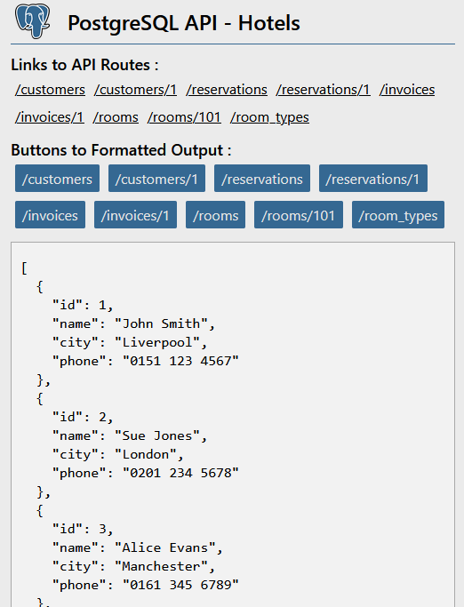

# PostgreSQL Hotels API

## Screenshot:

## Instructions:

1. clone this repo
2. install [postgresql](https://www.postgresql.org/)
3. inside the root of the repository, open a terminal:
4. create the database  
   `createdb cyf_hotel`
5. populate the database  
   `createdb -d cyf_hotel -f cyf-hotel.sql`
6. move to the api directory:  
   `cd cyf-hotels-api`
7. install the project dependencies:  
   `npm install`
8. start the server in develoment mode:
   `npm run dev`
9. visit http://localhost:3000

**Note: this project assumes you are connecting to the database with:**  
`username: postgres`  
`password: password`
