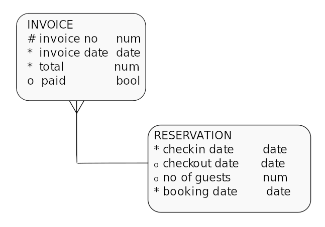
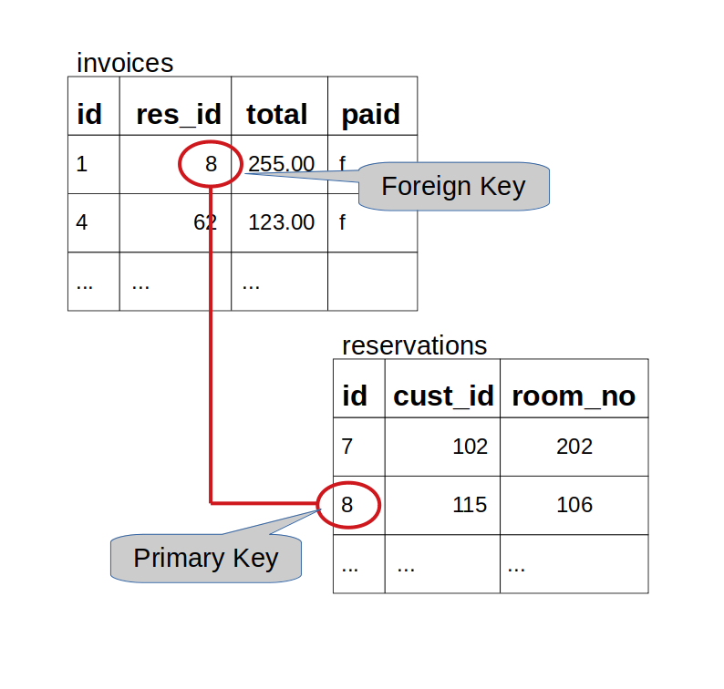

## Using Aggregate Functions

### Basic Aggregate Functions

How to calculate totals, averages, etc. over multiple rows.

You frequently need to get a single piece of information that is derived from multiple rows in a table. For example, when you need to know the total of all invoices for August 2018:

```sql
SELECT sum(total)
   FROM invoices
   WHERE invoice_date BETWEEN
         '2023-03-01' AND '2023-03-31';
```

```
   sum
---------
 8608.00
```

The aggregate functions are:

- `SUM()` : Calculate the total of the values in a column
- `AVG()` : Calculate the average (mean) of the values in a column
- `MIN() `: Determine the mimimum value of a column
- `MAX()` : Determine the maximum value of a column
- `COUNT()` : Count the number of values (non-null) in a column

All the above are in the SQL standard, most implementations provide others. SUM and AVG can only apply to numeric data, the others can apply to any datatype.

Further examples:

"What is the average length of stay at our hotel?" :

```sql
SELECT avg(checkout_date - checkin_date)
  FROM reservations;
```

```
        avg
--------------------
 3.2075471698113208
```

"What are the lowest and highest room rates we charge?" :

```sql
SELECT min(rate) AS lowest,
       max(rate) AS highest
  FROM rooms;
```

```
 lowest | highest
--------+---------
  85.00 |  123.00
```

You can use the count(x) function to count non-null values:

```sql
SELECT count(id) AS id_ct, count(postcode) AS post_ct
  FROM customers;
```

```
 id_ct | post_ct
-------+---------
   133 |     126
```

Notice that these two results show different values - there are NULL values for postcode but id is mandatory for all rows.

If you just want to count the number of rows, use `count(*)`. This is often used to find how many rows match a `WHERE` clause:

```sql
SELECT count(*)
  FROM customers
  WHERE country = 'Belgium';
```

```
 count
-------
     2
```

### Exercise 1

1.  Get the numbers of rows in each of the tables: rooms, room_types, customers and reservations.

```sql
SELECT count(*) FROM rooms;
```

```
 count
-------
    48
```

```sql
SELECT
  (SELECT count(*) FROM rooms) as rooms_rows,
  (SELECT count(*) FROM room_types) as room_types_rows,
  (SELECT count(*) FROM customers) as customers_rows,
  (SELECT count(*) FROM reservations) as reservations_rows;
```

```
 rooms_rows | room_types_rows | customers_rows | reservations_rows
------------+-----------------+----------------+-------------------
         48 |               5 |            133 |               106
```

2.  How many reservations do we have for next month?

```sql
SELECT COUNT(*)
FROM reservations
WHERE CAST(checkin_date AS text) LIKE '2023-05-%';
```

```
 count
-------
    30
```

```sql
SELECT COUNT(*)
FROM reservations
WHERE EXTRACT(MONTH FROM checkin_date) = EXTRACT(MONTH FROM CURRENT_DATE + 1)
AND EXTRACT(YEAR FROM checkin_date) = EXTRACT(YEAR FROM CURRENT_DATE);
```

```
 count
-------
    30
```

3.  How many invoices are still unpaid from over a month ago and what is the total owed?

```sql
SELECT COUNT(paid), SUM(total)
FROM invoices
WHERE paid = true;
```

```
 count |   sum
-------+----------
    56 | 18237.00
```

4.  What is the maximum gap in days between a customer booking a room and the checkin date for that booking?

```sql
SELECT MAX(checkin_date - booking_date)
FROM reservations;
```

```
 max
-----
  36
```

### Grouping Rows for Aggregation

You can calculate aggregates over subsets of rows using the GROUP BY clause:

```sql
SELECT count(*) FROM rooms
  GROUP BY room_type;
```

```
 count
-------
    14
    14
     8
    10
     2
```

What do you notice?

The query calculated the counts correctly but we have no idea which room type each value represents. To solve this we are allowed to include the GROUP BY expressions in the list of selected values, as below:

```sql
SELECT room_type, count(*) FROM rooms
  GROUP BY room_type;
```

```
 room_type    | count
--------------+-------
 PREMIUM      |    14
 PREMIER      |    14
 PREMIER PLUS |     8
 PREMIUM PLUS |    10
 FAMILY       |     2
```

Notice the `room_type` used for GROUP BY is also included in the SELECT list of values.

We can group by multiple expressions, for example:

```sql
SELECT trunc(room_no/100) AS floor,
       to_char(checkin_date, 'YYYY-MM') AS month,
       count(*),
       sum(no_guests),
       avg(no_guests)
  FROM reservations
  GROUP BY floor, month;
```

```
 floor |  month  | count | sum |          avg
-------+---------+-------+-----+------------------------
       | 2023-06 |    14 |  17 |     1.2142857142857143
     1 | 2023-04 |     3 |   5 |     1.6666666666666667
     4 | 2023-04 |     8 |  12 |     1.5000000000000000
     4 | 2023-03 |     7 |  10 |     1.4285714285714286
     2 | 2023-03 |    10 |  14 |     1.4000000000000000
     3 | 2023-04 |     8 |  12 |     1.5000000000000000
       | 2023-05 |    27 |  37 |     1.3703703703703704
     2 | 2023-04 |     8 |  14 |     1.7500000000000000
     2 | 2023-05 |     1 |   1 | 1.00000000000000000000
     1 | 2023-03 |    14 |  21 |     1.5000000000000000
     3 | 2023-05 |     2 |   3 |     1.5000000000000000
     3 | 2023-03 |     4 |   6 |     1.5000000000000000
```

Notice that the GROUP BY is using the column aliases `floor` and `month` that have been defined in the select list. This works in many, but not all, SQL implementations. (In those that don't allow aliases you must use the full expression, for example: `trunc(room_no/100)` instead of `floor`)

You can use a WHERE clause to restrict the rows that are included in the aggregate function. For example, if we need the above query for only the 2nd and 3rd floors:

```sql
SELECT trunc(room_no/100) AS floor,
       to_char(checkin_date, 'YYYY-MM') AS month,
       count(*),
       sum(no_guests),
       avg(no_guests)
  FROM reservations
  WHERE room_no BETWEEN 200 AND 399
  GROUP BY floor, month;
```

```
 floor |  month  | count | sum |          avg
-------+---------+-------+-----+------------------------
     2 | 2023-04 |     8 |  14 |     1.7500000000000000
     2 | 2023-03 |    10 |  14 |     1.4000000000000000
     3 | 2023-04 |     8 |  12 |     1.5000000000000000
     2 | 2023-05 |     1 |   1 | 1.00000000000000000000
     3 | 2023-05 |     2 |   3 |     1.5000000000000000
     3 | 2023-03 |     4 |   6 |     1.5000000000000000
```

Note that it is NOT usually possible to use column aliases in the where condition.

A WHERE clause is applied before any aggregation, if you need to restrict results using an aggregate function you can't do that using the WHERE clause.

In the above, to return only results with the number of reservations greater than, say, 4 we use the HAVING clause:

```sql
SELECT trunc(room_no/100) AS floor,
       to_char(checkin_date, 'YYYY-MM') AS month,
       count(*), sum(no_guests), avg(no_guests)
   FROM reservations
   GROUP BY floor, month
   HAVING count(*) > 4;    --<< Note the HAVING keyword
```

The order of clauses in the SELECT statement is:

```sql
SELECT ...
   FROM ...
   [WHERE ...]
   [GROUP BY ...
   [HAVING ...] ]
   [ORDER BY ...]
```

```
 floor |  month  | count | sum |        avg
-------+---------+-------+-----+--------------------
       | 2023-06 |    14 |  17 | 1.2142857142857143
     4 | 2023-04 |     8 |  12 | 1.5000000000000000
     4 | 2023-03 |     7 |  10 | 1.4285714285714286
     2 | 2023-03 |    10 |  14 | 1.4000000000000000
     3 | 2023-04 |     8 |  12 | 1.5000000000000000
       | 2023-05 |    27 |  37 | 1.3703703703703704
     2 | 2023-04 |     8 |  14 | 1.7500000000000000
     1 | 2023-03 |    14 |  21 | 1.5000000000000000
```

The square brackets indicate optional clauses. Note that HAVING is only relevant when you have a GROUP BY and must follow it in the SELECT statement.

It can be confusing at first knowing whether to use a WHERE clause or a HAVING clause with GROUP BY.

- Use the WHERE clause when values you want to test are available without having to use any aggregate functions (e.g. plain column values).

- Use HAVING when the values you want to test are the results of aggregate functions (e.g. `count(*)`, `sum(amount)`, `min(x)`, etc...).

---

### Exercise 2

1.  What is the grand total of all invoices for each month?

```sql
SELECT SUM(total) AS grand_total,
       to_char(invoice_date, 'Month YYYY') AS month
FROM invoices
GROUP by month;
```

```
 grand_total |     month
-------------+----------------
     9418.00 | April     2023
     8608.00 | March     2023
     1600.00 | May       2023
```

2.  How many guests could be accommodated at one time on each floor?

```sql
SELECT TRUNC(room_no/100) AS floor,
       SUM(no_guests) AS total_guests
FROM reservations
WHERE room_no IS NOT NULL
GROUP BY floor
ORDER BY floor;
```

```
 floor | total_guests
-------+--------------
     1 |           26
     2 |           29
     3 |           21
     4 |           22
```

3.  Which rooms have been occupied for less than 10 nights and for how many nights have they been occupied?

```sql
SELECT room_no, SUM(checkout_date - checkin_date) AS total_nights_occupied
FROM reservations
WHERE room_no IS NOT NULL
GROUP BY room_no
HAVING SUM(checkout_date - checkin_date) < 10
ORDER BY room_no;
```

```
 room_no | total_nights_occupied
---------+-----------------------
     101 |                     4
     102 |                     1
     103 |                     4
     104 |                     9
     106 |                     3
     107 |                     4
     108 |                     1
     109 |                     8
     110 |                     8
     112 |                     1
     201 |                     2
     202 |                     9
     203 |                     7
     204 |                     8
     208 |                     6
     209 |                     1
     210 |                     6
     212 |                     3
     301 |                     7
     302 |                     5
     303 |                     6
     304 |                     1
     305 |                     7
     306 |                     1
     309 |                     8
     311 |                     7
     312 |                     4
     401 |                     7
     402 |                     9
     404 |                     3
     405 |                     3
     408 |                     1
     409 |                     1
     410 |                     5
     411 |                     9
     412 |                     2

```

---

## Inserting, Updating and Deleting Rows

### Inserting data

To add new data to a table use the INSERT command that has the following format:

```sql
INSERT INTO table_name (column_name, ...)
       VALUES (value, ...)
```

For example:

```sql
INSERT INTO customers (name, email, address, city, postcode, country)
  VALUES ('John Smith','j.smith@johnsmith.org',
          '11 New Road','Liverpool','L10 2AB','UK');
```

```
 id  |    name    |         email         |     phone     |   address   |   city    | postcode | country
-----+------------+-----------------------+---------------+-------------+-----------+----------+---------
   1 | John Smith | j.smith@johnsmith.org | 0151 123 4567 | 11 New Road | Liverpool | L10 2AB  | UK
 134 | John Smith | j.smith@johnsmith.org |               | 11 New Road | Liverpool | L10 2AB  | UK
```

Note:

1. You do not need to supply the value for the automatically generated `id` column, it is populated from a sequence generator object.
2. The order of values in the `VALUES (...)` clause must correspond to the columns in the column name list. The first value is stored in the first named column, the second value in the second named column and so forth.

### Exercise 6

1. Insert yourself in the `customers` table. Query the table to check your new data.

```sql
INSERT INTO customers (name, email, phone, address, city, postcode, country)
VALUES ('Baz Murphy', 'bazmurphy@gmail.com', '0123 456 7890', '1 Old Road', 'London', 'EC1 1AB', 'UK');
```

```
 id  |    name    |        email        |     phone     |  address   |  city  | postcode | country
-----+------------+---------------------+---------------+------------+--------+----------+---------
 135 | Baz Murphy | bazmurphy@gmail.com | 0123 456 7890 | 1 Old Road | London | EC1 1AB  | UK
```

2. Insert a new room type of PENTHOUSE with a default rate of 185.00.

```sql
INSERT INTO room_types (room_type, def_rate)
VALUES ('PENTHOUSE', 185.00);
```

```
  room_type   | def_rate
--------------+----------
 FAMILY       |   123.00
 PREMIER      |   110.00
 PREMIER PLUS |   123.00
 PREMIUM      |    85.00
 PREMIUM PLUS |    98.00
 PENTHOUSE    |   185.00
```

---

### Updating Existing Data

When you need to change values in a table, use the `UPDATE` command. The general construction to update a row is:

```sql
UPDATE table
  SET column1 = value1,
      column2 = value2
  WHERE condition;
```

Note that `UPDATE` usually requires a `WHERE` clause to specify the row or rows to be updated. As with `SELECT`, if you don't specify a condition to restrict the rows, the command applies to all the rows in the table.

For example, to update the name and country of the customer with ID 3:

```sql
UPDATE customers
  SET name='Bob Marley',
      country='Jamaica'
  WHERE id=3;
```

```
 id |    name    |           email            |     phone     |   address   |    city    | postcode | country
----+------------+----------------------------+---------------+-------------+------------+----------+---------
  3 | Bob Marley | alice.evans001@hotmail.com | 0161 345 6789 | 3 High Road | Manchester | m13 4ef  | Jamaica
```

### Exercise 3

1.  Update the postcode of the customer named `Alice Evans` to `M21 8UP`

```sql
UPDATE customers
SET postcode = 'M21 8UP'
WHERE name = 'Alice Evans';
```

```
 id |    name     |           email            |     phone     |   address   |    city    | postcode | country
----+-------------+----------------------------+---------------+-------------+------------+----------+---------
  3 | Alice Evans | alice.evans001@hotmail.com | 0161 345 6789 | 3 High Road | Manchester | M21 8UP  | UK
```

2.  Update room 107 to allow up to 3 guests

```sql
UPDATE rooms
SET no_guests = 3
WHERE room_no = 107;
```

```
UPDATE rooms
SET no_guests = 3
WHERE room_no = 107;
```

3.  For the customer named `Nadia Sethuraman`, update her address to `2 Blue Street`, her city to `Glasgow` and her postcode to `G12 1AB` in one query

```sql
UPDATE customers
SET address = '2 Blue Street',
    city = 'Glasgow',
    postcode = 'G12 1AB'
WHERE name = 'Nadia Sethuraman';
```

```
 id |       name       |           email           | phone |    address    |  city   | postcode | country
----+------------------+---------------------------+-------+---------------+---------+----------+---------
  6 | Nadia Sethuraman | nadia.sethuraman@mail.com |       | 2 Blue Street | Glasgow | G12 1AB  | UK
```

4.  Update all the future bookings of customer with ID 96 to 3 nights (starting on the same check-in date) in one query

```sql
UPDATE reservations
SET checkout_date = checkin_date + INTERVAL '3 days'
WHERE cust_id = 96 AND checkin_date > CURRENT_DATE;
```

```
 id | cust_id | room_no | checkin_date | checkout_date | no_guests | booking_date
----+---------+---------+--------------+---------------+-----------+--------------
 74 |      96 |         | 2023-06-03   | 2023-06-06    |         1 | 2023-05-06
 80 |      96 |         | 2023-05-31   | 2023-06-03    |         1 | 2023-05-06
```

### Deleting a row

The syntax to delete a row is:

```sql
DELETE FROM table WHERE condition;
```

For example, to delete the booking with ID 4:

```sql
DELETE FROM reservations WHERE id=4;
```

**NOTE:** If you don't supply a `WHERE` clause with `DELETE` or `UPDATE` the command will be applied to **all** the rows in the table which is rarely what you want.

### Exercise 4

1.  Delete the bookings of customer ID `108` that do not have a room number assigned

```sql
DELETE FROM reservations
WHERE cust_id = 108 AND room_no IS NULL;
```

BEFORE

```
 id  | cust_id | room_no | checkin_date | checkout_date | no_guests | booking_date
-----+---------+---------+--------------+---------------+-----------+--------------
  28 |     108 |         | 2023-06-05   | 2023-06-08    |         1 | 2023-05-06
  85 |     108 |     405 | 2023-04-07   | 2023-04-08    |         2 | 2023-03-23
 105 |     108 |         | 2023-06-02   | 2023-06-04    |         1 | 2023-05-06
```

AFTER

```
 id | cust_id | room_no | checkin_date | checkout_date | no_guests | booking_date
----+---------+---------+--------------+---------------+-----------+--------------
 85 |     108 |     405 | 2023-04-07   | 2023-04-08    |         2 | 2023-03-23
```

2.  Delete all the bookings of customer Juri Yoshido (customer id 96)

```sql
DELETE FROM reservations
WHERE cust_id = 96
```

```sql
DELETE FROM reservations
WHERE cust_id IN (
  SELECT cust_id
  FROM reservations
  JOIN customers
  ON reservations.cust_id = customers.id
  WHERE customers.name = 'Juri Yoshido'
);
```

BEFORE

```
 id | cust_id | room_no | checkin_date | checkout_date | no_guests | booking_date
----+---------+---------+--------------+---------------+-----------+--------------
 74 |      96 |         | 2023-06-03   | 2023-06-06    |         1 | 2023-05-06
 80 |      96 |         | 2023-05-31   | 2023-06-03    |         1 | 2023-05-06

```

AFTER

```
 id | cust_id | room_no | checkin_date | checkout_date | no_guests | booking_date
----+---------+---------+--------------+---------------+-----------+--------------
(0 rows)
```

3.  Delete the customer details for Juri Yoshido

```sql
DELETE FROM customers
WHERE id = 96;
```

```sql
DELETE FROM customers
WHERE name = 'Juri Yoshido';
```

BEFORE

```
 id |     name     |         email         |   phone    |      address       |  city  | postcode | country
----+--------------+-----------------------+------------+--------------------+--------+----------+---------
 96 | Juri Yoshido | juri.yoshido@klqb.net | 6175559555 | 8616 Spinnaker Dr. | Boston | 51003    | USA

```

AFTER

```
 id | name | email | phone | address | city | postcode | country
----+------+-------+-------+---------+------+----------+---------
(0 rows)
```

---

## Joining tables

### Introduction

So far we've only looked at one table in any query. Many problems require data from several tables - how do we do that?

For example, if I want to phone or email customers who have not yet paid their invoices, which tables do I need to look at?

Use joins to combine data from more than one table. Joins use column values to match rows in one table to rows in another.

The join columns are usually referred to as foreign keys and primary keys.





### Foreign and Primary Keys

Each table should have a **Primary Key**. This is one or more columns whose values, which cannot be NULL, are combined to provide a unique identifying value for each row. Natural primary keys are often difficult to find so many tables use an arbitrary integer whose value is automatically generated when the row is created. When joining tables we need to match a single row to one or more other rows, usually in another table - for example, matching a customer to her/his reservations. The single row (customer) is usually identified by its primary key value.

**Foreign Keys** are the columns in a table that reference corresponding columns in another table (although self-referencing foreign keys can reference the same table). For example, the `res_id` column in the invoices table references the `id` column in the reservations table (see diagram above).

The referenced column is almost always the primary key of the referenced table because a foreign key must always reference exactly one row in the referenced table (primary keys guarantee that).

### Using JOIN in SQL

To join reservations and invoices in SQL:

```sql
SELECT r.cust_id, r.room_no, i.invoice_date, i.total
  FROM reservations r JOIN
       invoices i ON (r.id = i.res_id);
```

```
 cust_id | room_no | invoice_date | total
---------+---------+--------------+--------
     115 |     106 | 2023-03-13   | 255.00
      43 |     204 | 2023-03-13   | 425.00
      80 |     107 | 2023-03-15   | 340.00
     104 |     309 | 2023-03-16   | 738.00
      95 |     411 | 2023-03-16   | 615.00
      51 |     409 | 2023-03-19   | 123.00
     115 |     203 | 2023-03-20   | 255.00
       2 |     412 | 2023-03-20   | 246.00
     115 |     202 | 2023-03-22   | 170.00
      65 |     411 | 2023-03-23   | 246.00
```

**_Notice:_**

- The new keyword JOIN with ON (predicate)
- Table aliases (`r` and `i`) used to qualify columns

The new syntax follows the following pattern:

```sql
SELECT ...
  FROM ... [JOIN ... ON (...)]...
  [WHERE ...]
  [GROUP BY ... [HAVING ...] ]
  [ORDER BY ...]
```

Use the JOIN to define the combined row source then you can use WHERE, DISTINCT, GROUP BY, ORDER BY, etc... as with single-table queries. For example:

```sql
    SELECT r.cust_id, r.room_no, i.invoice_date, i.total
      FROM reservations r
      JOIN invoices i ON (i.res_id = r.id)
     WHERE r.checkin_date > '2018-07-01'
       AND i.total < 500
  ORDER BY i.invoice_date DESC, r.cust_id;
```

```
 cust_id | room_no | invoice_date | total
---------+---------+--------------+--------
      91 |     211 | 2023-05-04   | 490.00
     117 |     101 | 2023-05-04   | 340.00
      52 |     305 | 2023-05-03   | 110.00
      38 |     411 | 2023-04-30   | 246.00
      18 |     211 | 2023-04-28   | 196.00
       4 |     312 | 2023-04-27   | 369.00
      67 |     401 | 2023-04-27   | 110.00
      88 |     206 | 2023-04-25   |  85.00
      23 |     304 | 2023-04-23   | 110.00
      97 |     309 | 2023-04-22   | 246.00
      .....
```

There is no theoretical limit to the number of tables that can be joined in a query, although practical considerations like
complexity and performance must be considered. It is quite common, though, to find up to seven or eight tables joined in a query.

Multi-table joins just extend the syntax to add more tables, as below:

```sql
SELECT c.name, c.phone, c.email, i.invoice_date, i.total
  FROM customers c
  JOIN reservations r ON (r.cust_id = c.id)
  JOIN invoices i ON (r.id = i.res_id)
  WHERE i.invoice_date < current_date - interval '1 month'
    AND i.paid = FALSE
  ORDER BY i.invoice_date DESC, c.id;
```

```
       name       |     phone      |           email            | invoice_date | total
------------------+----------------+----------------------------+--------------+--------
 Mary Saveley     | 78.32.5555     | mary.saveley@yppl.net      | 2023-04-06   | 255.00
 Alice Evans      | 0161 345 6789  | alice.evans001@hotmail.com | 2023-03-31   | 255.00
 Roland Mendel    | 7675-3555      | roland.mendel@wclf.net     | 2023-03-20   | 255.00
 Eduardo Saavedra | (93) 203 4555  | eduardo.saavedra@tiqa.net  | 2023-03-19   | 123.00
 Wendy Victorino  | +65 224 1555   | wendy.victorino@ueai.net   | 2023-03-15   | 123.00
 Carmen Anton     | +34 913 728555 | carmen.anton@bhmy.net      | 2023-03-14   | 123.00
 Roland Mendel    | 7675-3555      | roland.mendel@wclf.net     | 2023-03-13   | 255.00
```

**_Note_**
You have just learned about what is called the INNER JOIN, which is the most common kind of join. Indeed, you can use the keyword INNER in the JOIN syntax, as follows:

```sql
SELECT c.name, c.phone, c.email, i.invoice_date, i.total
  FROM customers c
  INNER JOIN reservations r ON (r.cust_id = c.id)
  INNER JOIN invoices i ON (r.id = i.res_id)
  WHERE i.invoice_date < current_date - interval '1 month'
    AND i.paid = FALSE
  ORDER BY i.invoice_date DESC, c.id;
```

```
       name       |     phone      |           email            | invoice_date | total
------------------+----------------+----------------------------+--------------+--------
 Mary Saveley     | 78.32.5555     | mary.saveley@yppl.net      | 2023-04-06   | 255.00
 Alice Evans      | 0161 345 6789  | alice.evans001@hotmail.com | 2023-03-31   | 255.00
 Roland Mendel    | 7675-3555      | roland.mendel@wclf.net     | 2023-03-20   | 255.00
 Eduardo Saavedra | (93) 203 4555  | eduardo.saavedra@tiqa.net  | 2023-03-19   | 123.00
 Wendy Victorino  | +65 224 1555   | wendy.victorino@ueai.net   | 2023-03-15   | 123.00
 Carmen Anton     | +34 913 728555 | carmen.anton@bhmy.net      | 2023-03-14   | 123.00
 Roland Mendel    | 7675-3555      | roland.mendel@wclf.net     | 2023-03-13   | 255.00
```

The INNER keyword is not required (it's the default) but some organisations might require it for the sake of coding standards.

There are other kinds of JOIN, specifically the OUTER JOIN and the CROSS JOIN but these are less frequently used in applications.
If you want to find out about these kinds of JOIN refer to the [PostgreSQL documentation](https://www.postgresql.org/docs/12/queries-table-expressions.html).

---

### Exercise 5

1.  Try and understand each of the queries above in your `psql` prompt

Queries are printed above.

2.  Which customers occupied room 111 and what are their details?

```sql
SELECT r.room_no, c.name, c.email, c.phone, c.address, c.city, c.postcode, c.country
FROM customers c
INNER JOIN reservations r
ON (c.id = r.cust_id)
WHERE r.room_no = 111;
```

```
 room_no |     name     |         email         |     phone      |        address         |      city      | postcode |  country
---------+--------------+-----------------------+----------------+------------------------+----------------+----------+-----------
     111 | Palle Ibsen  | palle.ibsen@bjqn.net  | 86 21 3555     | Smagsloget 45          | Århus          | 8200     | Denmark
     111 | Mel Andersen | mel.andersen@nggg.net | 030-0074555    | Obere Str. 57          | Berlin         | 12209    | Germany
     111 | Ben Calaghan | ben.calaghan@bprq.net | 61-7-3844-6555 | 31 Duncan St. West End | South Brisbane | 4101     | Australia
```

3.  List the customer name, room details (room number, type and rate), nights stay and departure dates for all UK customers.

```sql
SELECT c.name, ro.room_no, ro.room_type, ro.rate, re.checkout_date - re.checkin_date AS nights_stay, checkout_date AS depature_date
FROM customers c
INNER JOIN reservations re
ON (c.id = re.cust_id)
INNER JOIN rooms ro
ON (re.room_no = ro.room_no)
WHERE c.country = 'UK'
ORDER BY re.checkout_date;
```

```
       name       | room_no |  room_type   |  rate  | nights_stay | depature_date
------------------+---------+--------------+--------+-------------+---------------
 Sue Jones        |     412 | FAMILY       | 123.00 |           2 | 2023-03-20
 Sue Jones        |     208 | PREMIUM PLUS |  98.00 |           6 | 2023-03-29
 Steven King      |     311 | PREMIER PLUS | 123.00 |           5 | 2023-03-31
 Alice Evans      |     204 | PREMIUM      |  85.00 |           3 | 2023-03-31
 Steven King      |     104 | PREMIUM      |  85.00 |           2 | 2023-04-01
 Helen Bennett    |     110 | PREMIUM PLUS |  98.00 |           5 | 2023-04-03
 Nadia Sethuraman |     211 | PREMIUM PLUS |  98.00 |           3 | 2023-04-06
 Mohammed Trungpa |     311 | PREMIER PLUS | 123.00 |           2 | 2023-04-19
 Mohammed Trungpa |     312 | PREMIER PLUS | 123.00 |           3 | 2023-04-27
 Thomas Smith     |     301 | PREMIER      | 110.00 |           6 | 2023-05-05
 Rachel Ashworth  |     302 | PREMIER      | 110.00 |           5 | 2023-05-09
```

4.  List name, phone and email along with all reservations and invoices for customer Mary Saveley.

```sql
SELECT c.name, c.phone, c.email, r.room_no, r.checkin_date, r.checkout_date, i.invoice_date, i.total, i.paid
FROM customers c
INNER JOIN reservations r
on (c.id = r.cust_id)
INNER JOIN invoices i
ON (r.id = i.res_id)
WHERE c.name = 'Mary Saveley'
ORDER BY r.checkout_date;
```

```
     name     |   phone    |         email         | room_no | checkin_date | checkout_date | invoice_date | total  | paid
--------------+------------+-----------------------+---------+--------------+---------------+--------------+--------+------
 Mary Saveley | 78.32.5555 | mary.saveley@yppl.net |     109 | 2023-03-28   | 2023-03-30    | 2023-03-30   | 196.00 | t
 Mary Saveley | 78.32.5555 | mary.saveley@yppl.net |     206 | 2023-04-03   | 2023-04-06    | 2023-04-06   | 255.00 | f
 Mary Saveley | 78.32.5555 | mary.saveley@yppl.net |     103 | 2023-04-08   | 2023-04-12    | 2023-04-12   | 340.00 | t
```

---
